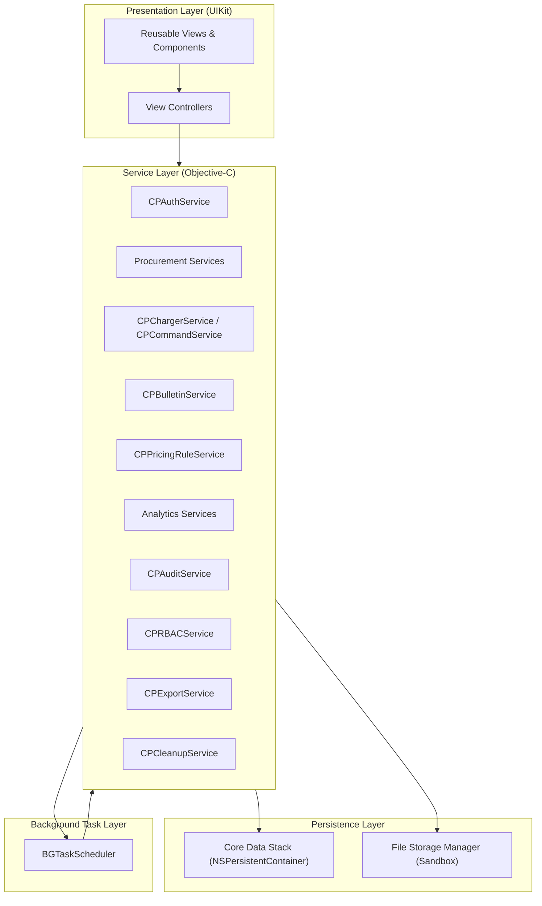
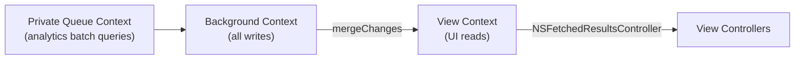
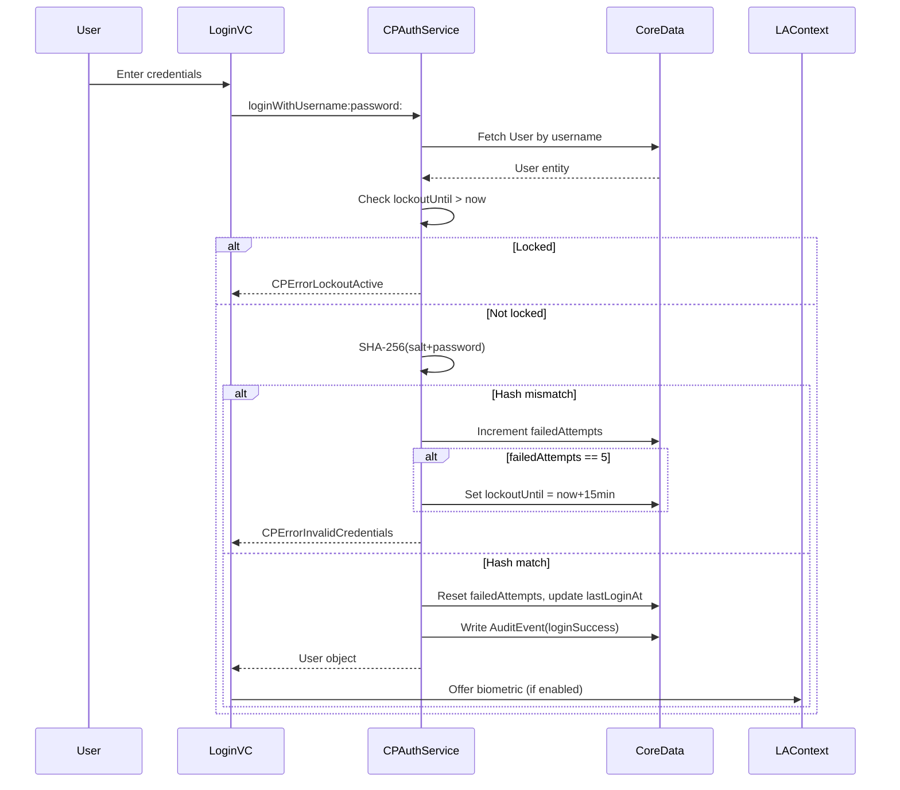
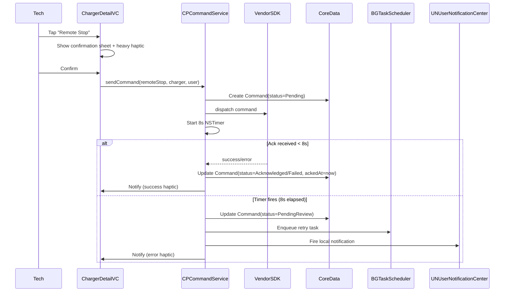
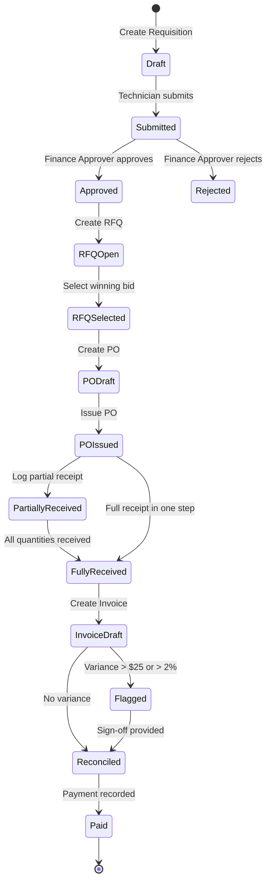
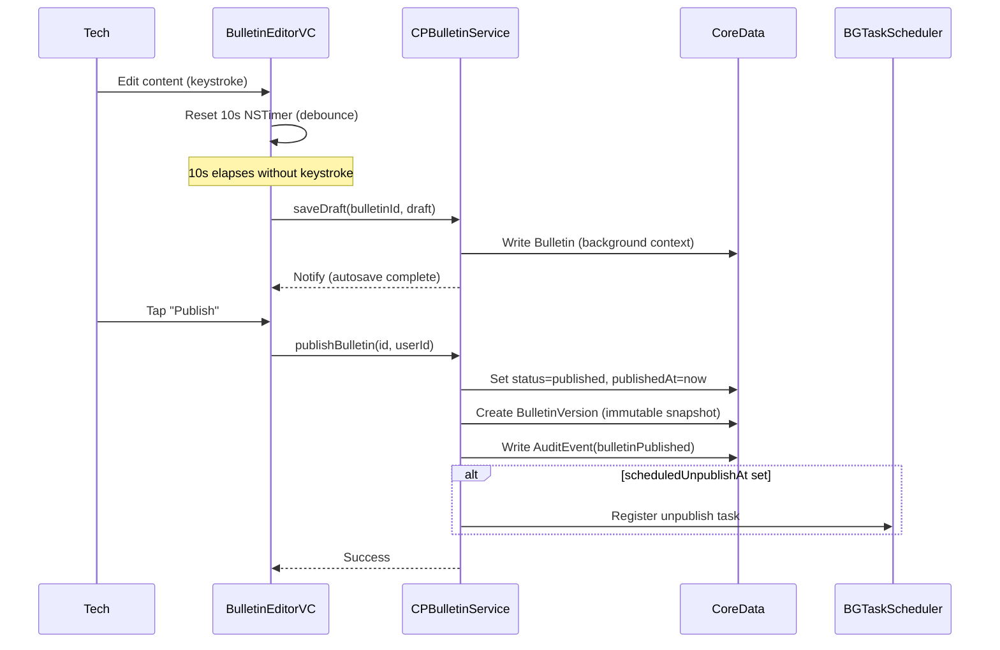
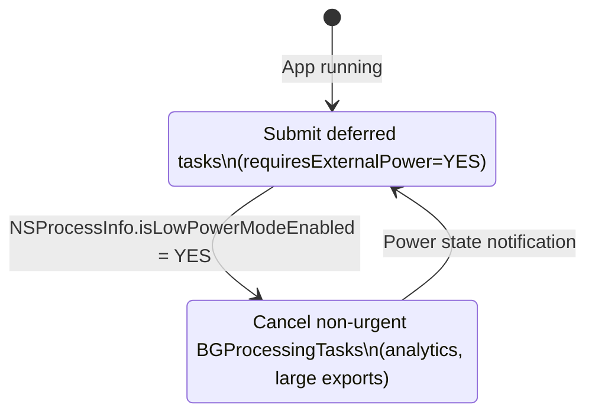
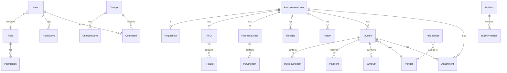

# ChargeProcure Field Operations — Design Document

**Platform:** iOS 15.0+ (iPhone + iPad, Universal)
**Language:** Objective-C
**UI Framework:** UIKit with Auto Layout
**Persistence:** Core Data (SQLite, fully on-device)
**No network backend, no remote database, no third-party services**

---

## 1. System Overview

ChargeProcure Field Operations is an iOS application that enables three operational roles — Administrator, Site Technician, and Finance Approver — to manage EV charging site operations, procurement workflows, pricing rules, and compliance documentation entirely on-device. The system operates in fully offline mode; all data stays within the app sandbox.

### 1.1 High-Level Architecture



---

## 2. Component Architecture

### 2.1 Layered Structure

```
┌─────────────────────────────────────────────────────────┐
│                   Presentation Layer                    │
│  UITabBarController (iPhone) / UISplitViewController    │
│  (iPad) → UINavigationControllers → ViewControllers     │
│  Reusable components: CPStatusBadgeView, CPActionCard,  │
│  CPConfirmationSheetController, CPToastView             │
└────────────────────────┬────────────────────────────────┘
                         │ service calls (completion blocks)
┌────────────────────────▼────────────────────────────────┐
│                    Service Layer                         │
│  CPAuthService        CPBulletinService                  │
│  CPBiometricService   CPPricingRuleService               │
│  CPSessionManager     CPDepositRuleService               │
│  CPRBACService        CPStreakCalculator                  │
│  CPRequisitionService CPCompletionRateService            │
│  CPRFQService         CPHeatmapService                   │
│  CPPurchaseOrder...   CPTrendService                     │
│  CPReceiptService     CPAnomalyDetector                  │
│  CPInvoiceService     CPExportService                    │
│  CPReconciliation...  CPAuditService                     │
│  CPPaymentService     CPCleanupService                   │
│  CPStatementService   CPBackgroundTaskManager            │
│  CPChargerService     CPCommandService                   │
└────────────┬──────────────────────────┬─────────────────┘
             │                          │
┌────────────▼──────────┐  ┌────────────▼────────────────┐
│   Core Data Stack      │  │   File Storage Manager      │
│   NSPersistentCont.    │  │   <AppSandbox>/Library/     │
│   viewContext (main)   │  │   Attachments/              │
│   backgroundContext    │  │   <AppSandbox>/Documents/   │
│   (all writes)         │  │   exports/                  │
└────────────────────────┘  └─────────────────────────────┘
```

### 2.2 Core Data Context Strategy



- **All mutations** happen on `newBackgroundContext()`.
- **UI reads** use `viewContext` (automatically merges changes from parent).
- **Batch analytics** use a separate private-queue context that does not write.

---

## 3. Data Flow Diagrams

### 3.1 Authentication Flow



### 3.2 Charger Command Dispatch Flow



### 3.3 Procurement Closed-Loop Flow



### 3.4 Bulletin Publish Flow



---

## 4. Security Design

### 4.1 Password Storage

```
User creates password "securePass1"
          │
          ▼
SecRandomCopyBytes(16) → salt (16 bytes)
          │
          ▼
CC_SHA256(salt || UTF8(password)) → hash (32 bytes)
          │
          ▼
Store User.passwordSalt = salt
Store User.passwordHash = hash
          │
Login attempt:
          ▼
Recompute CC_SHA256(storedSalt || UTF8(inputPassword))
Compare vs stored hash (constant-time memcmp)
```

### 4.2 Biometric Keychain Protection

- Keychain item storing the authentication token uses:
  - `kSecAttrAccessibleWhenPasscodeSetThisDeviceOnly` — not accessible if no device passcode set.
  - `kSecAccessControlBiometryCurrentSet` — invalidated if biometrics change on device.
- `LAContext` evaluates `LAPolicyDeviceOwnerAuthenticationWithBiometrics`.

### 4.3 Audit Immutability

- `AuditEvent` entity overrides `validateForUpdate:` to always return `CPErrorAuditImmutable`.
- No delete operation exposed in service layer for AuditEvent.
- Core Data store protections rely on iOS app sandbox (not accessible to other apps).

---

## 5. File Storage Design

### 5.1 Attachment Lifecycle

```
User selects file (UIImagePickerController / UIDocumentPickerViewController)
          │
          ▼
CPFileStorageManager.validateFile:
  - Check: data.length ≤ 25 MB
  - Check: magic header bytes match JPEG / PNG / PDF
          │
          ├── Fail → return CPErrorAttachmentTooLarge or CPErrorAttachmentInvalidType
          │
          ▼ Pass
Generate UUID filename, determine destination path:
  bulletins: Library/Attachments/bulletins/<UUID>.<ext>
  invoices:  Library/Attachments/invoices/<UUID>.<ext>
          │
          ▼
NSFileManager copyItemAtURL:toURL:error:
          │
          ▼
Create Attachment Core Data entity (filePath = relative path)
```

### 5.2 Weekly Cleanup

```
BGProcessingTask fires (device charging + idle)
          │
          ▼
CPCleanupService.runWeeklyCleanup:
          │
          ├─ Fetch drafts: status=draft AND isPinned=NO AND createdAt < now-90d
          │   ├─ Delete sandbox file (if exists)
          │   └─ Delete Core Data record
          │
          ├─ Enumerate Library/Attachments/**
          │   For each file path:
          │     Query Core Data: any Attachment.filePath matches?
          │     If NO → delete file
          │
          └─ Write AuditEvent(cleanupCompleted, count=N)
```

---

## 6. Analytics Design

### 6.1 Moving Average & Anomaly Detection

```
Data: array of daily event counts D[0..N-1]
Moving average at index i (window W=30):
  MA[i] = mean(D[i-W+1 .. i])

Volatility anomaly at day i:
  if D[i] > 3 × MA[i] → flag

Gap anomaly between events e[j] and e[j+1]:
  if (e[j+1].timestamp - e[j].timestamp) > 72 hours → flag
```

### 6.2 Computation Threading

```
Analytics request from VC (main thread)
          │
          ▼
NSOperationQueue (background QoS)
  └─ CPTrendService / CPAnomalyDetector / CPHeatmapService
          │  (computations on background thread)
          ▼
dispatch_async(main_queue):
  └─ Update VC with results
          │
          ▼
VC reloads UICollectionView / CALayer chart
```

---

## 7. Background Task Design

### 7.1 Registered Task Identifiers

| Task ID | Trigger Condition | Work Done |
|---|---|---|
| `com.chargeprocure.cleanup.weekly` | Device charging + idle | Delete old drafts + orphaned files |
| `com.chargeprocure.reports.overnight` | Device charging + idle | Compute analytics, cache anomaly flags |
| `com.chargeprocure.bulletin.scheduler` | Time-based (BGAppRefreshTask) | Transition bulletin states at scheduled time |
| `com.chargeprocure.command.retry` | On-demand after timeout | Retry failed charger commands |

### 7.2 Low Power Mode Handling



---

## 8. Adaptive Layout Design

### 8.1 iPhone (Compact Width)

```
┌─────────────────────┐
│   Status Bar        │
├─────────────────────┤
│   Navigation Bar    │
│                     │
│   Content Area      │
│   (UIScrollView /   │
│    UITableView)     │
│                     │
│                     │
│                     │
├─────────────────────┤
│   Tab Bar (5 tabs)  │
│   ████ ████ ████    │  ← thumb-reachable
└─────────────────────┘
```

### 8.2 iPad (Regular Width — Split View)

```
┌──────────┬──────────────────────────┐
│ Sidebar  │   Detail / Content       │
│          │                          │
│ Nav Menu │   Dashboard / Feature    │
│ (role-   │   View                   │
│ filtered)│                          │
│          │                          │
└──────────┴──────────────────────────┘
```

---

## 9. Performance Design

| Concern | Design Decision |
|---|---|
| Cold start < 1.5s | `NSPersistentContainer` initialized lazily; minimal `didFinishLaunching` work |
| Long list scrolling | `NSFetchedResultsController` + `UITableView.prefetchDataSource`; `fetchBatchSize=50` |
| Image display | `NSCache<NSString *, UIImage *>` keyed by file path; auto-evicted on memory pressure |
| Analytics computation | NSOperationQueue (background QoS); results dispatched to main queue |
| Memory warning | `NSCache` purged; in-flight analytics NSOperations cancelled; chart animations paused |
| Pagination | `fetchLimit=50`, `fetchOffset=page×50` via `NSFetchedResultsController` |

---

## 10. Entity Relationship Overview


